

  
  <h1 align="center">星河避难所</h1> 

  

---

这是一个星际公民 Android 客户端，可以简化部分官网操作以及信息查询。

A Star Citizen Android Application.

### 实现功能

+ 官网登录相关
  + [x] 免代理登录/注册
  + [x] 多账号一键切换
  + [x] 光谱账号一键切换
+ 官网信息相关
  + [x] 玩家个人信息显示
  + [x] 官网玩家查询
  + [x] 舰船信息查询
  + [x] 玩家信息查询
  + [x] 组件信息查询
  + [x] 快速查看机库价值/消费额/邀请点数
  + [x] 一键进入舰队页面
+ 官网游戏相关
  + [x] 一键重置玩家角色(无视官网重置时间限制)
  + [x] 一键拷贝/重置PTU账号
+ 官网消费相关
  + [x] 机库信息显示(状态/价值/入库时间/自动堆叠/详细信息查看/保险时间显示)
  + [x] 回购信息显示(入库时间/自动堆叠)
  + [x] 一键回收/礼物/取消礼物
  + [x] 升级舰船
  + [x] 官网商店物品筛选/查询
  + [x] 官网商店物品一键购买(自动添加信用点)
+ 其他功能&特性
  + [x] 教程查看
  + [x] 离线缓存

### 实现截图

部分截图

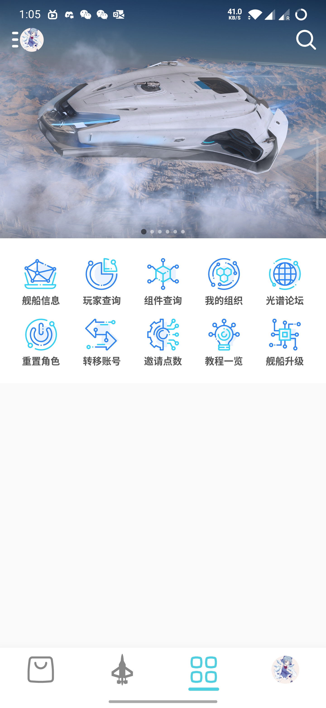
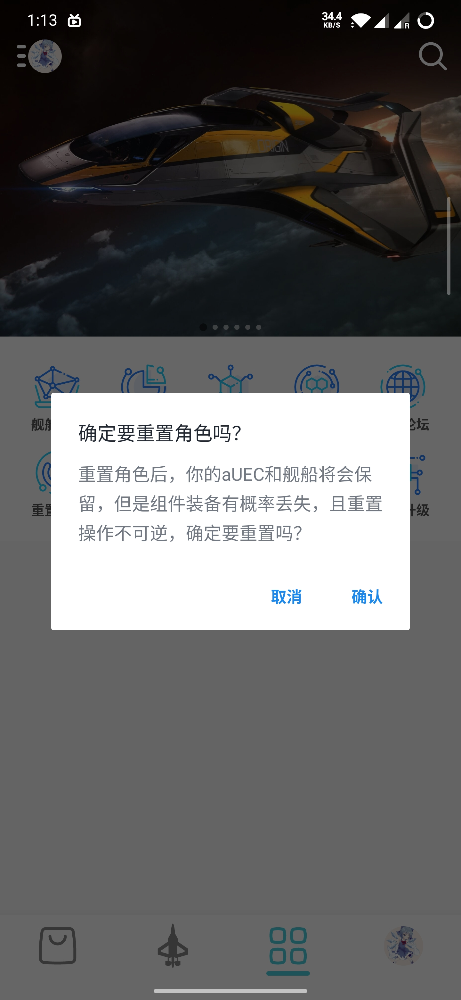
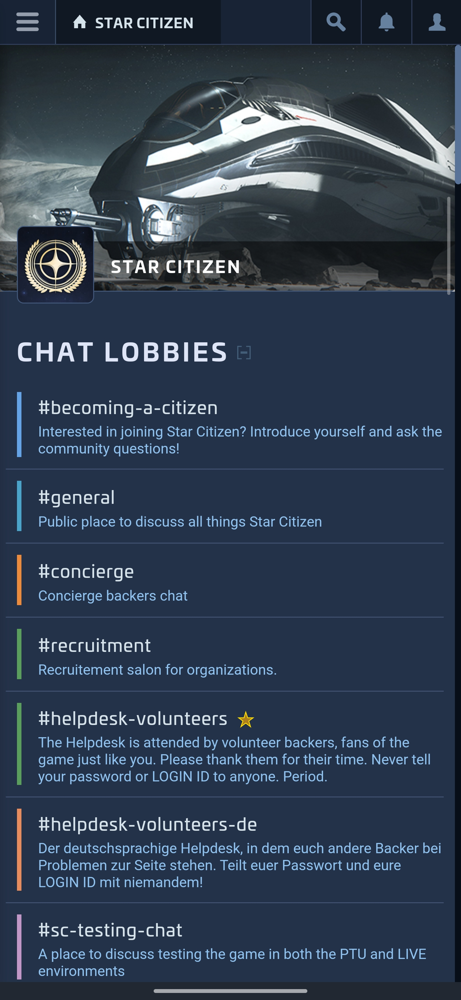
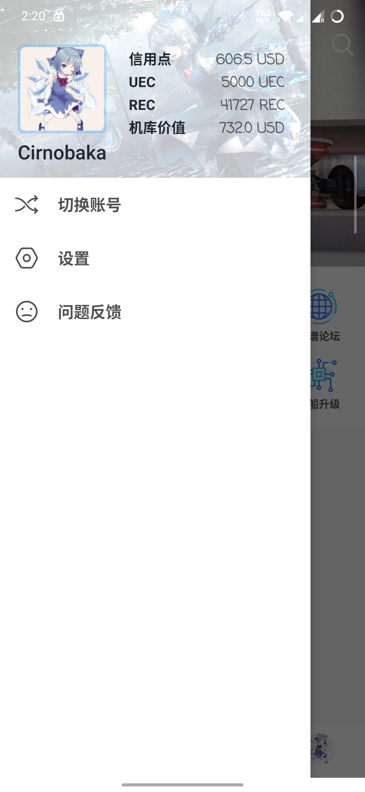
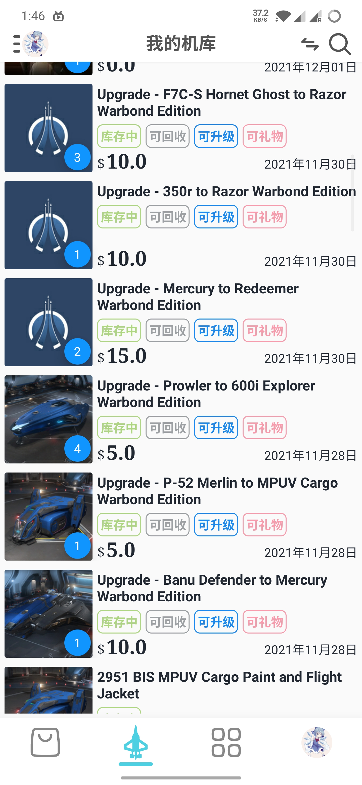
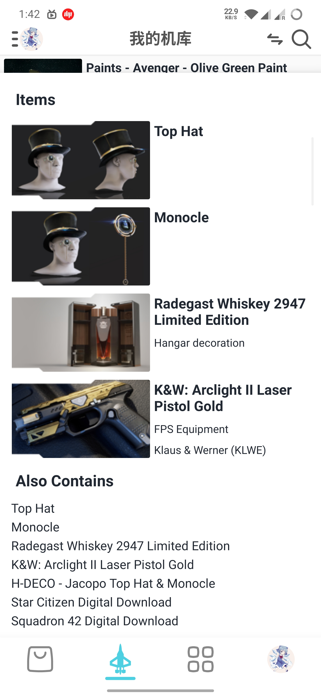
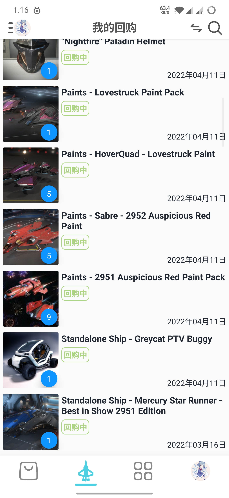
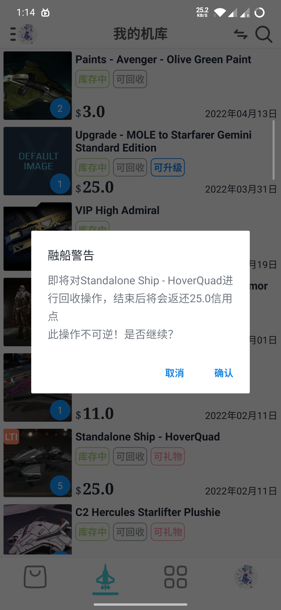
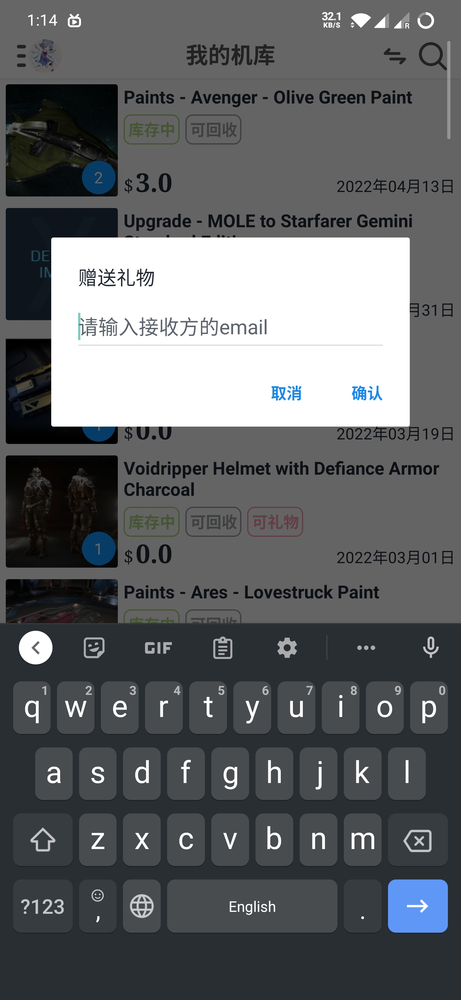
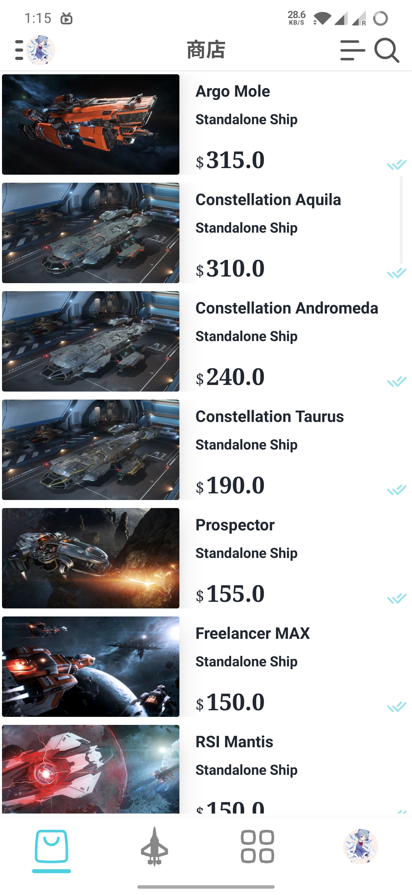
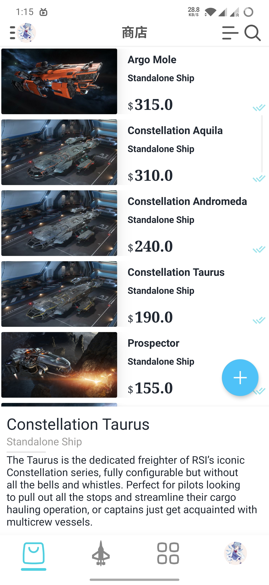

